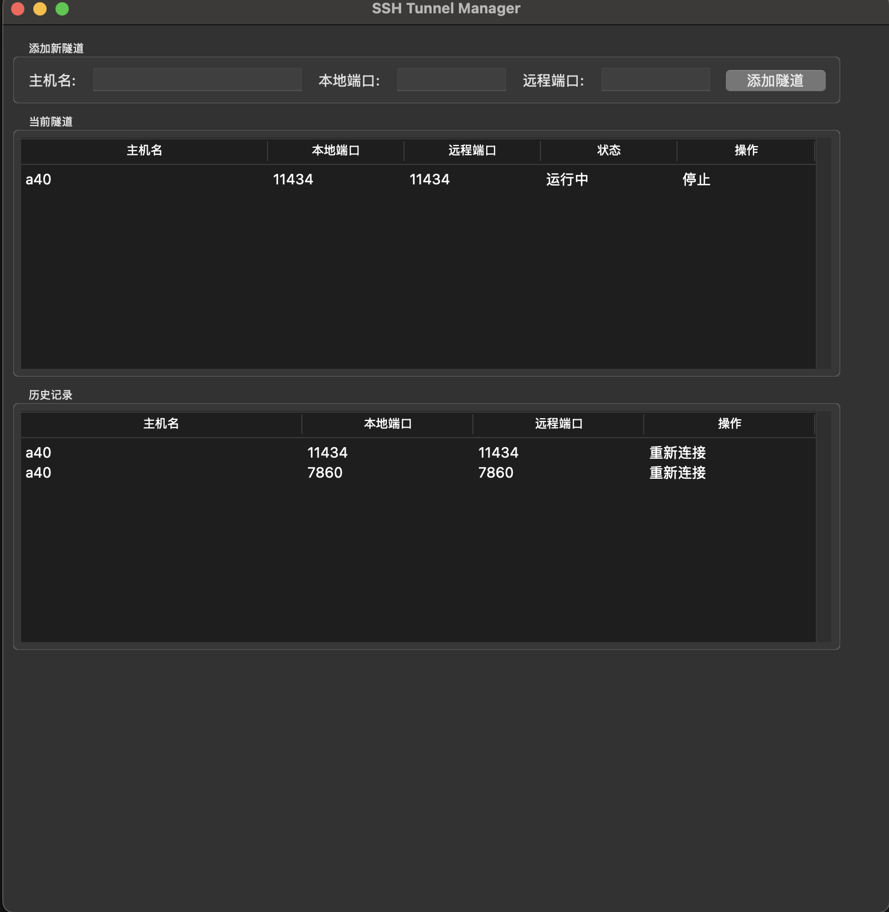
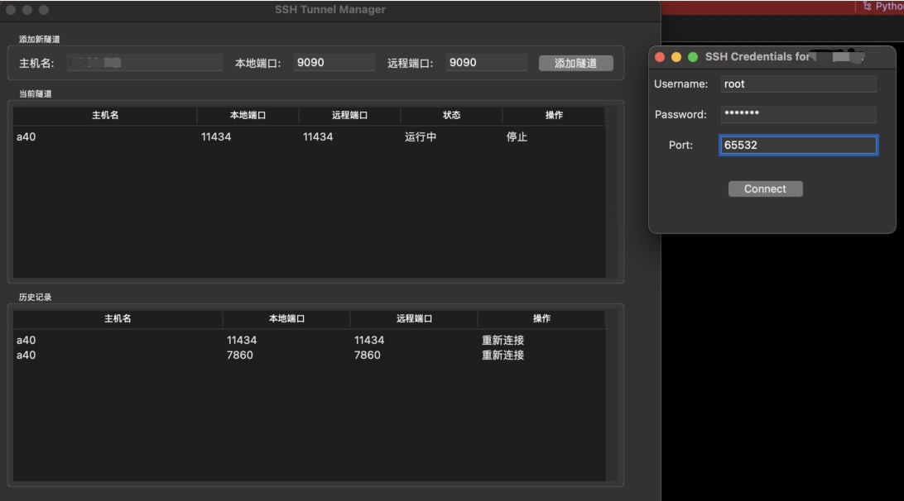

# SshTunelManager

ssh tunnel manager （ssh 隧道 管理）

## Describe

### en

- This project is used to manage SSH local mapping. Equivalent to the ssh - L command.

- Enter the host name and first go back to the ~/.ssh/config file to read the configuration. If it is not found, an input box will pop up, requiring you to enter your account, password, and port

### cn

- 该项目是用来管理ssh 本地映射的。相当于ssh -L 命令。

- 输入主机名首先回去~/.ssh/config 文件内读取配置，如果没有找到，会弹出输入框，需要输入账号，密码、端口

#### hostname find in ssh_config



#### hostname not find in ssh_config



## how to use

1. install tkinter

   ````
   # mac
   brew install ruby
   
   # linux 
   apt install tk8.6
   ````

2. install python depentence

````
pip install paramiko
````

3. run

   ````
   python main.py
   ````
